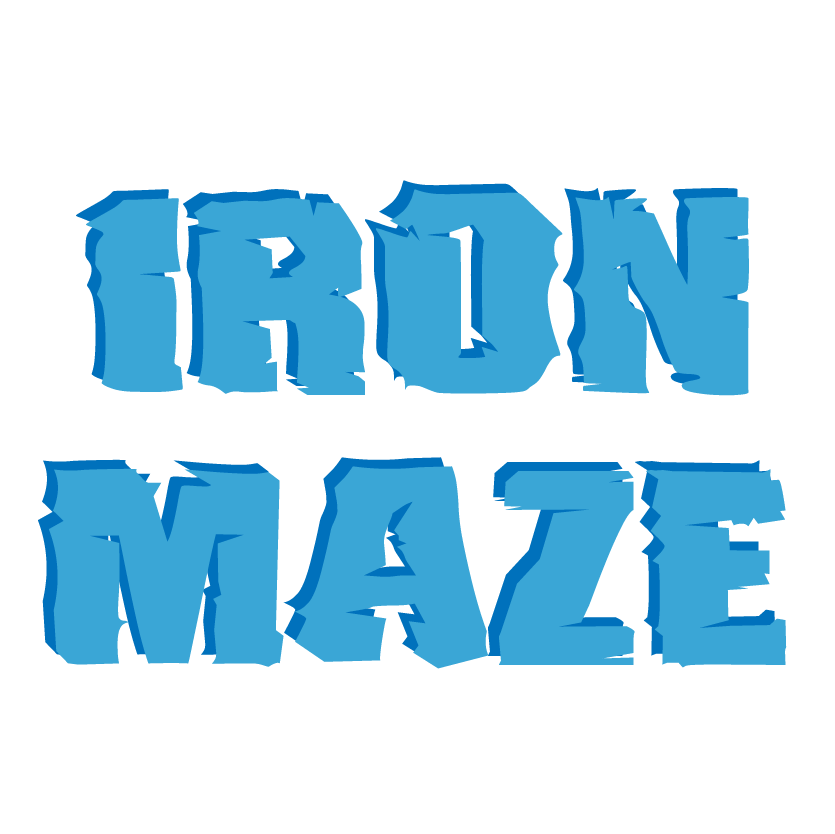

## About Us
We are Carlos and Julián, two students from Ironhack Barcelona's Full Stack Development Bootcamp, and this is our first project where we have combined CSS, HTML, and JavaScript to develop it.

## Deployment
You can play the game [here](https://juliancasillasp.github.io/the-game/)

## About the Game
Using the cursor, you must reach the goal without leaving the path.

## Controls
Cursor.

## Victory Condition
Successfully completing all three levels and reaching the goal.

## Defeat Condition
Collision between the cursor and the border.

## Classes

|   Class   | Properties                                        | Methods                                                                            |
| :-------: | ------------------------------------------------- | ---------------------------------------------------------------------------------- |
|   Player  |    x, y, w, h                                     | draw(contexto), handleMouseMove(event, canvas, context), handleMouseOut(contexto)  |
|   Game    |   canvas, ctx, player, map, intervalId, iteracion | start(), clear (), print(), recalculate(), showGameOverScreen(), showWinScreen()   |                                    
